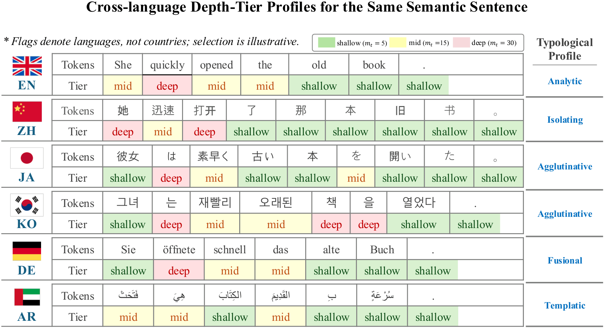
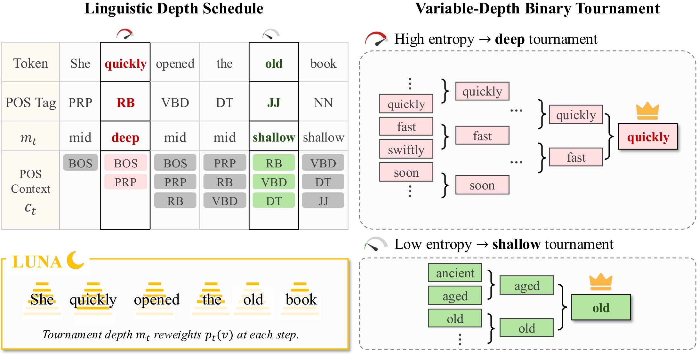
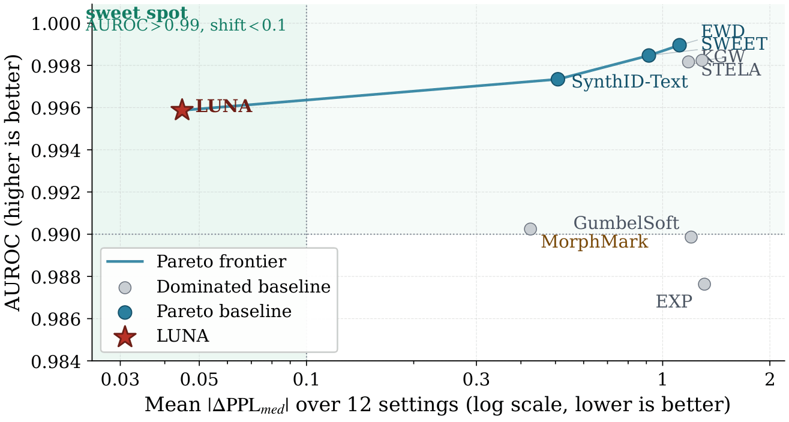
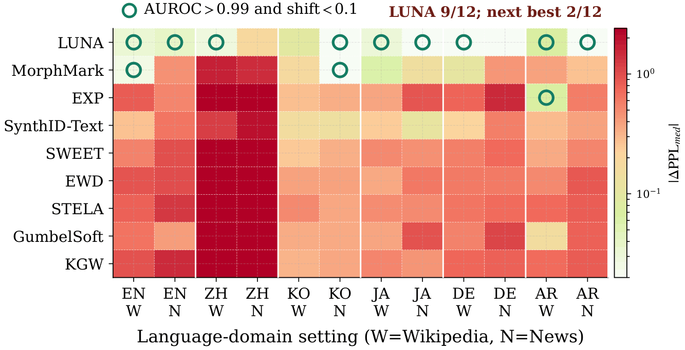
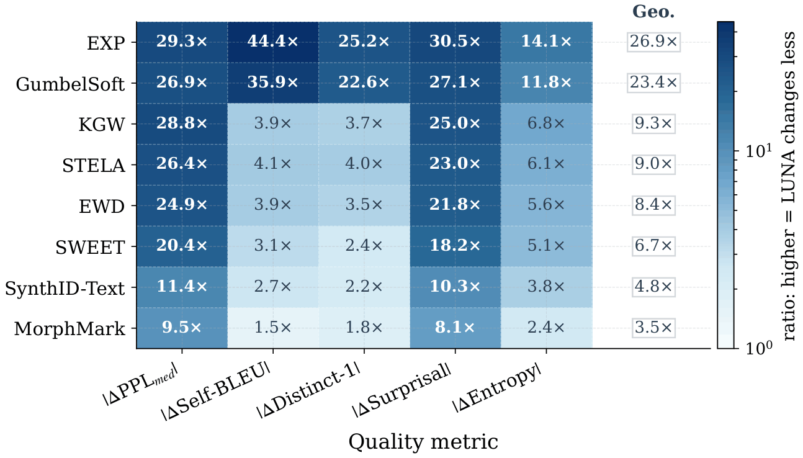

# LUNA: Linguistics-Aware Non-Distortionary LLM Watermarking

LUNA (**L**ing**u**istics-Aware **N**on-Distortionary LLM W**a**termarking) is a multilingual decoding-time watermark that combines:

1. **single-token non-distortion** under the standard random-key model,
2. **model-free detection**, and
3. **linguistic adaptivity** from part-of-speech (POS) context uncertainty.

The core idea is simple: different linguistic contexts provide different amounts of natural grammatical choice. LUNA estimates how uncertain the next POS tag is after a POS context, then uses that signal to decide how much non-distortionary SynthID-style tournament depth to apply at each generation step.

The code in this repository implements LUNA on top of SynthID-style binary tournament watermarking, includes precomputed multilingual POS-entropy lookup tables, and provides scripts for the Wikipedia and news experiments used in the paper.

---

## Table of Contents

- [Research overview](#research-overview)
- [Method summary](#method-summary)
- [Main empirical findings](#main-empirical-findings)
- [Repository structure](#repository-structure)
- [Environment setup](#environment-setup)
- [Data, languages, models, and POS analyzers](#data-languages-models-and-pos-analyzers)
- [Running experiments](#running-experiments)
- [Citation](#citation)

---

## Research overview

### Motivation

Large language models can generate fluent text at scale. This creates a practical need for **provenance**, **attribution**, and **misuse auditing**: after a piece of text has been produced, we often want to know whether it may have come from a particular generation system.

Decoding-time watermarking addresses this by inserting a statistical signal during generation and testing for that signal later. However, a deployment-ready text watermark needs to balance several requirements that often pull in different directions.

First, a watermark should preserve generation quality. A distribution-shifting watermark can make detection strong by biasing the next-token distribution, but this can also change fluency, diversity, or likelihood under a reference model. LUNA therefore targets **single-token non-distortion**: under the standard random-key model, the next-token marginal distribution equals the base distribution after marginalizing over watermark randomness.

Second, verification should not require access to the original model. Some adaptive methods use model entropy or logits at detection time, which means that the verifier must run the target model or a surrogate model. This is operationally expensive and weakens third-party auditability. LUNA targets **model-free detection**: the detector uses the text, tokenizer, POS analyzer, precomputed lambda table, and secret key, but does not need a language-model forward pass.

Third, watermark capacity is not uniform across languages or positions. Multilingual deployment makes this especially important because morphology, segmentation, word order, and writing systems change where a watermark can be inserted naturally. English, Chinese, Korean, Japanese, German, and Arabic differ sharply in POS structure and typological profile. LUNA addresses this with **linguistic adaptivity** rather than model-side entropy.

### Key intuition

LUNA treats the local POS context as a reusable, model-independent signal of how much grammatical choice a position affords.

For example, after an English context like `DET ADJ` in a phrase such as “a quiet ...”, the next POS tag is often a noun. The grammatical choice is relatively constrained. In contrast, after some Korean morpheme-level POS contexts, the next position may plausibly continue with a verb, adverbial phrase, modifier, or another construction. The grammatical choice is more diffuse.

LUNA turns this intuition into a normalized entropy value, `lambda(c)`, for a POS context `c`. High `lambda(c)` means the observed next-tag distribution is diffuse; low `lambda(c)` means it is concentrated. During generation, high-lambda contexts receive a deeper tournament and low-lambda contexts receive a shallower one.



**Figure 1.** The same semantic sentence produces different depth-tier profiles across languages. In LUNA, shallow uses `m_t = 5`, mid uses `m_t = 15`, and deep uses `m_t = 30`.

---

## Method summary

### 1. Estimate POS-context uncertainty

For a language `L`, LUNA estimates the next fine-grained POS tag distribution after a POS context `c` from an external calibration corpus. Let `S_{L,c}` be the set of next tags observed after `c`, and let `K_{L,c}=|S_{L,c}|`. With empirical probabilities `P_L(q' | c)`, LUNA computes:

$$
H_L(c)
=
-\sum_{q' \in S_{L,c}}
P_L(q' \mid c)
\log_2 P_L(q' \mid c)
$$

and then normalizes it by the maximum entropy over the observed support:

$$
\lambda_L(c)=
\begin{cases}
0 & K_{L,c}\le 1 \\
\dfrac{H_L(c)}{\log_2 K_{L,c}} & K_{L,c}>1
\end{cases}
$$

Thus `lambda_L(c)` lies in `[0, 1]`. It is a corpus-estimated syntactic uncertainty signal, not a language-model entropy signal.

The submitted code contains precomputed `lambda_{lang}_k{k}.json` tables for six languages and `k in {2, 3, 4}`.

### 2. Map lambda to tournament depth

LUNA maps `lambda(c_t)` to a three-tier depth schedule:

$$
m_t=
\begin{cases}
m_{\min} & \lambda(c_t)<\tau_1 \\
m_{\mathrm{mid}} & \tau_1\le\lambda(c_t)<\tau_2 \\
m_{\max} & \lambda(c_t)\ge\tau_2
\end{cases}
$$

The default depth ladder in the code is:

$$
m_{\min}=5,\qquad
m_{\mathrm{mid}}=15,\qquad
m_{\max}=30
$$

If `tau1` and `tau2` are not explicitly provided in the JSON config, the implementation computes them as the frequency-weighted 25th and 75th percentiles of the primary lambda table.

The schedule is **prefix-measurable**: at generation step `t`, the POS context, lambda value, and depth are all determined before the current token `x_t` is sampled.

### 3. Use a non-distortionary binary tournament backbone

LUNA builds on the SynthID-Text binary tournament mechanism. At each step, the base model provides a next-token distribution `p_t(v)`. LUNA applies only the first `m_t` keyed binary tournament layers, where `m_t` is selected by the linguistic schedule.



**Figure 2.** LUNA reconstructs the POS context from the prefix, looks up `lambda(c_t)`, maps it to a depth `m_t`, and applies an `m_t`-layer binary tournament before sampling.

### 4. Detect without model logits

The detector reconstructs the same POS-driven schedule from the observed text. It uses:

- the tokenizer,
- the language-specific POS tagger,
- the lambda lookup table,
- the secret key, and
- the observed token sequence.

It does **not** run the target language model or a surrogate model. The detector aligns POS spans to token positions, reconstructs `m_t` and the lambda weight at each valid token position, and computes a weighted z-score. In the submitted code, the default watermark decision is:

$$
\mathrm{is\_watermarked}=(z_{\mathrm{score}}>4.0)
$$

### 5. Scope of the non-distortion guarantee

The theoretical claim is intentionally narrow. LUNA preserves the **single-token marginal distribution under the standard random-key model** when the depth schedule is prefix-measurable. This does not claim equality of the full joint sequence distribution for a fixed key, and it does not provide an inherent guarantee against paraphrase, translation, editing, or adversarial attacks.

---

## Notation

| Symbol | Meaning |
|---------|---------|
| $c_t$ | POS context at generation step $t$ |
| $\lambda(c_t)$ | normalized POS-context entropy |
| $m_t$ | tournament depth selected for step $t$ |
| $m_{\min}$ | shallow tournament depth |
| $m_{\mathrm{mid}}$ | medium tournament depth |
| $m_{\max}$ | deep tournament depth |
| $\tau_1,\tau_2$ | lambda thresholds for depth scheduling |
| $H_L(c)$ | POS-context entropy |
| $K_{L,c}$ | number of observed next-tag types |

---

## Main empirical findings

The paper evaluates six languages and two domains, giving 12 language-by-domain settings. The six languages are English, Chinese, Korean, Japanese, German, and Arabic. The two domains are Wikipedia and news.

The main comparison includes eight baselines: KGW, EWD, SWEET, MorphMark, STELA, GumbelSoft, EXP, and SynthID-Text. The submitted software focuses on the LUNA implementation and its SynthID-style components; the aggregate baseline results below are reported from the submitted manuscript.

| Method | AUROC | TPR@5% FPR | $\lvert\Delta\mathrm{PPL}_{\mathrm{med}}\rvert$ | 95% CI for $\lvert\Delta\mathrm{PPL}_{\mathrm{med}}\rvert$ | $\lvert\Delta\mathrm{Self\text{-}BLEU}\rvert$ | $\lvert\Delta\mathrm{Distinct\text{-}1}\rvert$ | $\lvert\Delta\mathrm{Surprisal}\rvert$ | $\lvert\Delta\mathrm{Entropy}\rvert$ |
|---|---:|---:|---:|---:|---:|---:|---:|---:|
| KGW | 0.9982 | 0.9952 | 1.290 | [0.625, 2.133] | 0.0063 | 0.0106 | 0.1357 | 0.0789 |
| EWD | **0.9990** | **0.9972** | 1.115 | [0.554, 1.820] | 0.0063 | 0.0101 | 0.1186 | 0.0645 |
| SWEET | 0.9985 | 0.9950 | 0.915 | [0.474, 1.482] | 0.0050 | 0.0068 | 0.0989 | 0.0589 |
| MorphMark | 0.9902 | 0.9643 | 0.425 | [0.158, 0.734] | 0.0024 | 0.0052 | 0.0442 | 0.0275 |
| STELA | 0.9982 | 0.9953 | 1.182 | [0.620, 1.911] | 0.0065 | 0.0114 | 0.1250 | 0.0711 |
| GumbelSoft | 0.9899 | 0.9778 | 1.202 | [0.485, 2.112] | 0.0575 | 0.0653 | 0.1473 | 0.1370 |
| EXP | 0.9876 | 0.9777 | 1.310 | [0.509, 2.286] | 0.0711 | 0.0728 | 0.1659 | 0.1640 |
| SynthID-Text | 0.9972 | 0.9928 | 0.463 | [0.219, 0.751] | 0.0040 | 0.0062 | 0.0514 | 0.0396 |
| **LUNA** | 0.9959 | 0.9868 | **0.045** | **[0.022, 0.073]** | **0.0016** | **0.0029** | **0.0054** | **0.0116** |

The main pattern is that detection performance is saturated across several methods, while LUNA substantially reduces quality shifts. LUNA has the lowest mean shift on all five quality metrics in the 12-setting aggregate.

### Detection-quality Pareto view



LUNA occupies the low-distortion endpoint of the Pareto frontier. In the 12-setting mean, it is the only method in the region defined by AUROC `> 0.99` and `|ΔPPL_med| < 0.1`.

### Per-setting sweet spot



LUNA reaches the sweet-spot regime in 9 of the 12 language-domain settings. The next-best baseline reaches it in 2 of 12 settings.

### Multi-metric quality advantage



Each cell reports the baseline's mean distortion divided by LUNA's mean distortion. Values greater than 1 mean that LUNA changes the metric less. Across the eight main baselines and five quality metrics shown in the figure, LUNA has a uniform advantage.

### Controlled comparisons

The paper also reports controlled comparisons against three references:

| Comparison | AUROC difference, LUNA - control | TPR@5% difference, LUNA - control | PPL shift factor, control / LUNA | Self-BLEU factor | Distinct-1 factor | Surprisal factor | Entropy factor |
|---|---:|---:|---:|---:|---:|---:|---:|
| LUNA - STELA | -0.0023 | -0.0085 | 26.41x | 4.07x | 3.96x | 22.99x | 6.12x |
| LUNA - SynthID-Text | -0.0013 | -0.0060 | 10.35x | 2.53x | 2.15x | 9.45x | 3.41x |
| LUNA - SynthID-Text-Entropy | -0.0001 | -0.0007 | 1.76x | 1.59x | 0.92x | 1.69x | 1.70x |

The first comparison isolates the value of moving from a distortionary POS-based green-list watermark to a non-distortionary tournament backbone. The second isolates the value of adding linguistic scheduling to a tournament watermark. The third tests whether model-side entropy can substitute for LUNA's POS-context entropy; it gives nearly identical detection, but requires model forward passes at verification time and is not model-free.

---

## Repository structure

```text
.
├── config/
│   ├── LUNA_en_k2.json
│   ├── LUNA_en_k3.json
│   └── ...                         # 6 languages x k={2,3,4}
├── data/
│   ├── wiki_en.jsonl
│   ├── news_en.jsonl
│   ├── lambda_en_k2.json
│   └── ...                         # datasets and precomputed lambda tables
├── evaluation/
│   └── dataset.py                  # legacy dataset utilities from MarkLLM
├── exceptions/
│   └── exceptions.py
├── experiments/
│   ├── dataset.py                  # dataset loading
│   ├── model_config.py             # model IDs and generation settings
│   ├── evaluation/                 # detection and quality metrics
│   └── runners/run_experiment.py   # one language x dataset experiment runner
├── scripts/
│   └── main_experiment/
│       ├── run_news.sh
│       ├── run_wikipedia.sh
│       └── run_main_chunk.py
├── utils/
│   ├── transformers_config.py
│   ├── utils.py
│   └── openai_utils.py
├── visualize/
│   └── ...                         # visualization helpers
├── watermark/
│   ├── auto_config.py
│   ├── auto_watermark.py
│   ├── synthid/
│   ├── synthid_stochastic/
│   └── luna/
│       ├── luna.py
│       ├── lambda_lookup.py
│       ├── pos_tagger.py
│       └── span_scheduler.py
├── watermark.yaml                  # conda environment file
└── README.md
```

---

## Environment setup

### Create the conda environment

The provided environment file is `watermark.yaml`. It defines a conda environment named `watermark` with Python 3.10 and the required Python packages.

```bash
conda env create -f watermark.yaml
conda activate watermark
```

---

## Data, languages, models, and POS analyzers

### Evaluation datasets

The repository contains two dataset families:

| Dataset family | Files | Records |
|---|---:|---:|
| Wikipedia continuations | `data/wiki_{lang}.jsonl` for 6 languages | 3,000 total |
| News continuations | `data/news_{lang}.jsonl` for 6 languages | 3,000 total |

Each language-domain file contains 500 records. Each JSONL record has the following fields:

```json
{
  "lang": "en",
  "title": "...",
  "instruction": "...",
  "prompt": "...",
  "text": "..."
}
```

### Lambda tables

The repository includes precomputed lambda tables:

```text
data/lambda_{lang}_k{k}.json
```

for:

```text
lang in {en, zh, ko, ja, de, ar}
k    in {2, 3, 4}
```

Each table stores metadata (`lang`, `k`, `tagset`, `analyzer`) and the `m_phi` mapping from POS contexts to normalized next-tag entropy values.

| Language | POS backend in code | Tagset | k=2 entries | k=3 entries | k=4 entries |
|---|---|---|---:|---:|---:|
| English (`en`) | spaCy | PTB | 50 | 2,243 | 48,122 |
| Chinese (`zh`) | HanLP | CTB | 37 | 1,154 | 17,526 |
| Korean (`ko`) | Kiwi | Sejong | 56 | 2,467 | 38,145 |
| Japanese (`ja`) | SudachiPy SplitMode A | UniDic | 51 | 2,306 | 50,800 |
| German (`de`) | spaCy | STTS | 55 | 2,285 | 41,044 |
| Arabic (`ar`) | CAMeL Tools / Stanza fallback | PATB/PADT in code path; lambda metadata uses PADT | 565 | 22,226 | 236,359 |

### Generation models

The experiment runner uses the following generation models:

| Language | Model identifier |
|---|---|
| English | `meta-llama/Llama-3.2-1B-Instruct` |
| Chinese | `Qwen/Qwen2.5-0.5B-Instruct` |
| Korean | `LGAI-EXAONE/EXAONE-3.5-2.4B-Instruct`, revision `8e6fc27` |
| Japanese | `sbintuitions/sarashina2.2-3b-instruct-v0.1` |
| German | `utter-project/EuroLLM-1.7B-Instruct` |
| Arabic | `inceptionai/jais-family-1p3b-chat` |

The PPL reference model used by the code is:

```text
Qwen/Qwen2.5-1.5B
```

### Generation protocol in code

The code's base generation settings are defined in `experiments/model_config.py`:

```text
do_sample = True
temperature = 0.7
top_p = 0.95
top_k = 0
max_new_tokens = 256
min_new_tokens = 200
repetition_penalty = 1.0
```

For the Chinese Qwen2.5-0.5B model, the code applies `repetition_penalty = 1.1` via the small-model override.

---

## Running experiments

Run commands from the project root, where `config/`, `data/`, `experiments/`, `scripts/`, and `watermark/` are visible.

### 1. Run the Wikipedia wrapper

```bash
bash scripts/main_experiment/run_wikipedia.sh
```

The wrapper runs LUNA for all six languages on `wiki`, with `num-samples = 500`, `temperature = 0.7`, and outputs under:

```text
results/main_wiki_T0.7/
```

### 2. Run the news wrapper

```bash
bash scripts/main_experiment/run_news.sh
```

The wrapper runs LUNA for all six languages on `news`, with outputs under:

```text
results/main_news_T0.7/
```

### 3. Reproduce paper-selected LUNA context orders

The convenience wrappers use the code's default k-selection fallback if no `k` is specified. The paper reports selected `k` values separately for LUNA and STELA. For LUNA, the selected values are:

| Language | Wikipedia k | News k |
|---|---:|---:|
| English | 3 | 3 |
| Chinese | 4 | 4 |
| Korean | 3 | 3 |
| Japanese | 3 | 4 |
| German | 4 | 3 |
| Arabic | 2 | 2 |

To run the paper-selected LUNA k values for Wikipedia:

```bash
python -u scripts/main_experiment/run_main_chunk.py \
  --pairs "LUNA en 3" "LUNA de 4" "LUNA ar 2" "LUNA zh 4" "LUNA ja 3" "LUNA ko 3" \
  --dataset wiki \
  --temperature 0.7 \
  --num-samples 500 \
  --results-root results/main_wiki_T0.7_selected_k
```

To run the paper-selected LUNA k values for news:

```bash
python -u scripts/main_experiment/run_main_chunk.py \
  --pairs "LUNA en 3" "LUNA de 3" "LUNA ar 2" "LUNA zh 4" "LUNA ja 4" "LUNA ko 3" \
  --dataset news \
  --temperature 0.7 \
  --num-samples 500 \
  --results-root results/main_news_T0.7_selected_k
```

---

## Citation

```text

```
